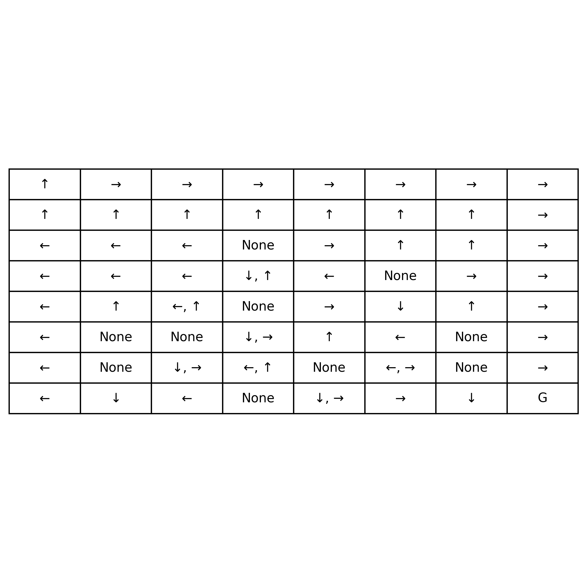
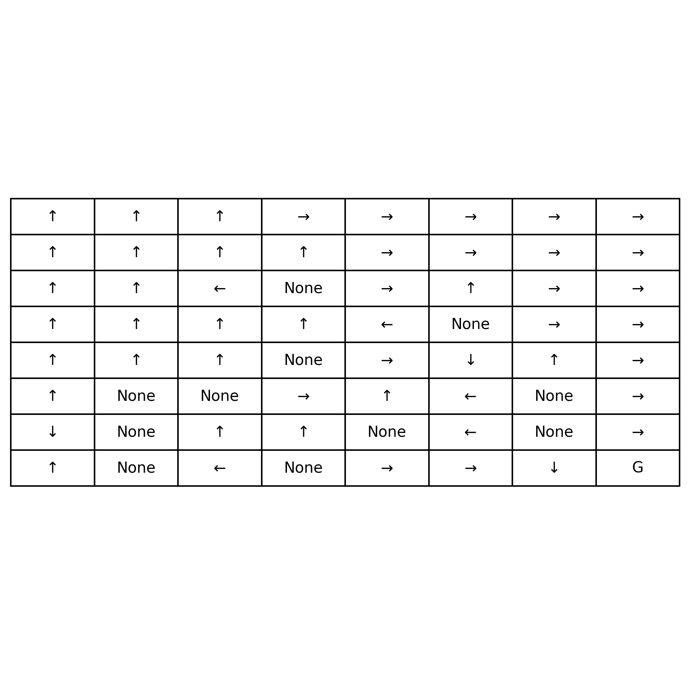
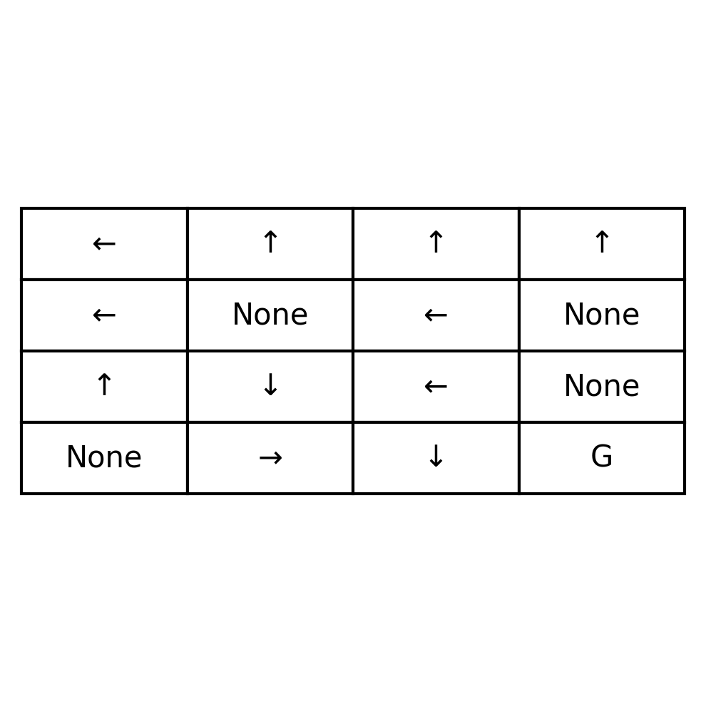
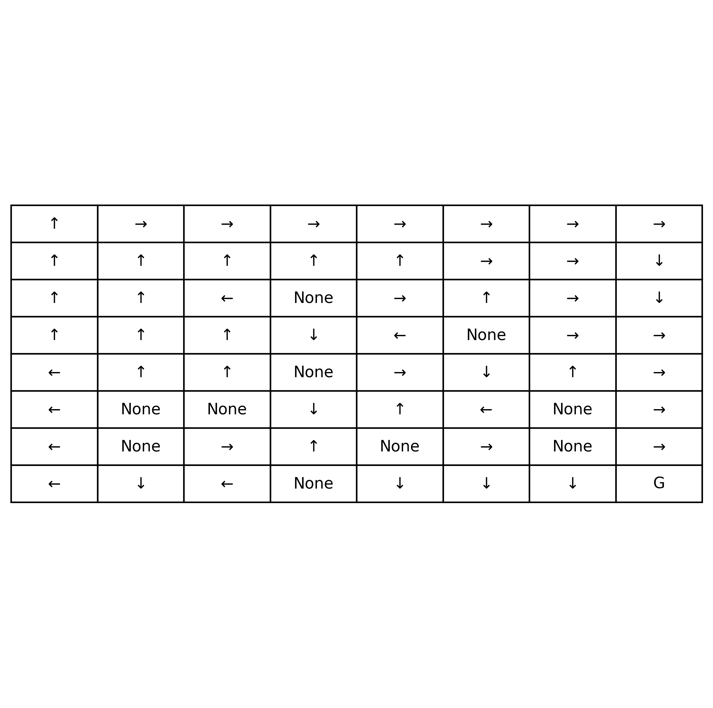

# Reinforcement Learning in Videogames

## Introduction

This is my end-of-degree project about Reinforcement Learning in videogames, the objective of this project is to implement, test and compare diferent reinforcement learning algorithms ranging form simple tabular methods to more complex Deep RL methods.

# Tabular Methods

These methods consist on filling a table with values for each state-action pair, later this table will be used to obtain the optimal policy which indicates the behavior the agent has to follow in order to have the best chance to reach the goal. 

These methods will be tested in the Frozen-Lake environment, in which a character has to reach the goal without falling into a hole, the catch is that there is that the agent doesn't always move where it wants to. For example if the agent wants to move down there is a 33% chance of going left or a 33% chance of going right instead. I will test the algorithms in two different frozen lake maps, a 4x4 and an 8x8.

## Dynamic Programming

I have implemented the value-iteration method which works by repeatedly updating the state values using the Bellman optimality equation until convergence, meaning that when the changes in the state values are smaller than a threshold we stop the algorithm since its already arrived at the optimal value function from which we can obtain the optimal policy. 

For this methods complete knowledge of the environment is required.

### Results in 4x4

This is the policy obtained in 4x4:

This is the optimal policy in this map, it is impossible to reach the goal with 100% accuracy in this map, after a 1000 episodes of testing with this policy it reaches an 85% accuracy and it takes 0.04 seconds. 

### Results in 8x8

This is the policy obtained in 8x8:

This is the optimal policy in this map, it is possible to reach the goal with 100% accuracy in this map since the agent can keep going through the sides of the map avoiding the holes and it will evetually reach the goal, after a 1000 episodes of testing with this policy it reaches 100% accuracy and it takes 0.37 seconds. 

## Monte Carlo

Unlike Dynamic Programmic these methods don't require complete knowledge of the environment since it learns by interacting with the environment itself. 

The method I have implemented starts with a policy where everything is 0, it simulates episodes and updates the policy after an episode is finished with the cumulative reward of the path followed during the episode. I am using First-Visit to update the policy, which means that only the first time a state is visited starting from the end counts towards the cumulative reward and the values of said state are only updated the first time. This is done because the first time it appears is the time that the action taken leads to ending the episode (reaching the goal or falling into a hole).

### Results in 4x4

This is the policy obtained in 4x4:

Monte Carlo is unable to reach the optimal policy in 350.000 episodes, though it is really close, the only not optimal action is in the 3rd cell of row 1 where it would be optimal to go up since it gets you to a safer path. This algorithm can reach this exact same policy in less episodes than 350.000 making it faster, however sometimes there is variance in the results and although most of the time it will reach this policy sometimes it will reach a less optimal policy. Since Monte Carlo only updates after the episode is over it takes more time to obtain good results consistently.

The accuracy obtained by this policy testing it in 1000 episodes is 75%, an it takes 73s.

### Results in 8x8

This is the policy obtained in 8x8:

Here the algorithm doesn't reach the optimal policy either it gets around 90% after 2.000.000 episodes though there is some variance usually around 5%, with less episodes it can also reach policies of around 90% accuracy however there will more variance, I've gotten policies of 90% with half this many episodes but I also got policies of around 75% sometimes, so this many episodes make the learning process more consistent. If more episodes where added maybe it could reach a higher accuracy however at this point we are reaching deminishing returns where the training time is so high I don't thinks is worth it to get a little bit more accuracy. With 2 million episodes it takes around 1150s to train though it can be around a minute longer or shorter due to randomness in training.

## TD Learning

This method also learns form trial-and-error like Monte Carlo methods did, the main difference is the update formula and the time updates are made to the state values. It updates after each step and instead of using the cumulative rewards of the episode it uses this formula: 

Q(s, a) ← Q(s, a) + α [r + γ * max_a'(Q(s', a')) − Q(s, a)]
**Where:**
    Q(s,a) = current estimate of the action-value
    α = learning rate
    r = reward
    γ = discount factor
    s′ = next state
    a′ = possible actions in the next state

I have implemented the Q-learning method where the table is being updated after each step and at the end the state value pair with the highest value is the optimal action in that state.

### Results in 4x4

This is the policy obtained in 4x4:

It reaches the optimal policy in 10.000, has 85% accuracy testing it in 1000 episodes and it takes 2s to train.

### Results in 8x8

This is the policy obtained in 8x8:

It doesn't reach the optimal policy in the 8x8 map, it gets around 90% accuracy training for 200.000 episodes, though there is some varience, around 2%. It gets similar results as Monte Carlo in accuracy, however it is much faster taking around 110s to train.

## Conclusions

Value Iteration is by far the best method in this specific environment, Q-Learning would be second and Monte Carlo last. Even though Value iteration is very good here it is unusable on environments where the rewards o probability transitions are unknown. In other environments with more frequent rewards than Frozen-Lake, where the only reward is obtained by reaching the goal, I would expect the results to be a bit closer between the algorithms since Monte Carlo and Q-learning can take a while to reach the first reward.